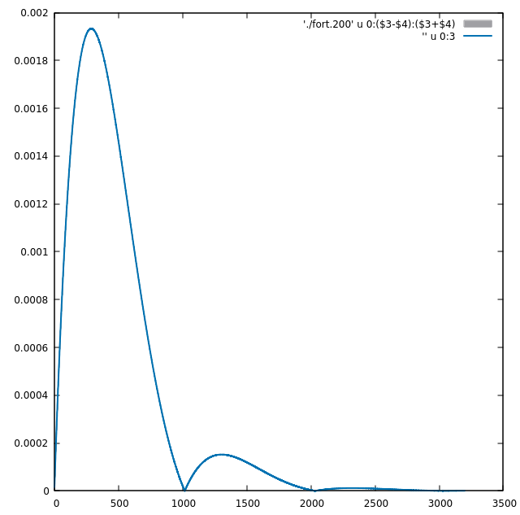

# Dynamic of the particle system

## Pure harmonic forces
Here we explore the dynamics of the particle system. For this system with $N$ masses equal to ${m}$ and coordinates ${\mathbf{r}_i}$, we will suppose that particles are bounded with springs with constant $k$ and zero rest position for the harmonic forces. This lead to the following coupled system of differential equations:

$$
m \ddot{\mathbf{r}}_i = -k (2\mathbf{r}_i-\mathbf{r}_{i-1} -\mathbf{r}_{i+1} ),
$$

with cyclic conditions.

In this approach we solve numerically the above equations using the Runge-Kutta 4th order method.

If we consider a circular initial state at rest, and we let evolve system, we have that evolution will be completely isotropically towards the center. Moreover the particles crosses the center oscillating periodically.

In the following Figures, in the first row we show this behavior for $N=500$ particles starting at rest with initial $r_i = 1$. All the springs constants are equal ($k = 1$)

Particles at four instants  |  Mean value of r as function of time | Mean value of velocity as function of time
:-------------------------:|:-------------------------:|:------:|
  |   | 
| |

In the second and third row we have added some randomness to the initial position distribution (uniformed distributed between 0 and 0.05 for each component of $\mathbf{r}_i$)

## Damping

Following in complexity, we introduce drag forces proportional to the velocity of each particle. this lead to damped oscillations

$$
m \ddot{\mathbf{r}}_i = -k (2\mathbf{r}_i-\mathbf{r}_{i-1} -\mathbf{r}_{i+1} ) - b \mathbf{v}_i,
$$

In the 1st row of the following Figure, $b = 0.005$ for the same elastic constant as previous case. In the second row, the case of overdamped oscilations

Particles at four instants  |  Mean value of r as function of time | Mean value of velocity as function of time
:-------------------------:|:-------------------------:|:------:|
  |    | 
  |   | 
 |   | 

Finally, in the 3rd row we can see the case of overdamping with randomness in the coordinates of the initial state

## External force

We can define constant forces that acts in the outer direction on each particle. For the perfect circular symmetry, these forces resemble the pressure of a gaseous system. Now the force over each particle can be defined as

$$
m \ddot{\mathbf{r}}_i = -k (2\mathbf{r}_i-\mathbf{r}_{i-1} -\mathbf{r}_{i+1} ) - b \mathbf{v}_i + \lambda \hat{\mathbf{r}}_i.
$$

In the former Equation, $\lambda$ is a constant and $\hat{\mathbf{r}}_i$ the unitary vector in the radial direction. Here, to enhance the effects of the external force over those of elastic and drag forces we use $b=0.5$ for $\lambda = 0.0000175$. 

In the first row we show a weak external force, this lead to oscillating movement (even with a large drag force). 
> The second row shows that **we need to redefine the external force related to the center of mass**

Particles at four instants  |  Mean value of r as function of time | Mean value of velocity as function of time
:------------------:|:------------:|:------:|

